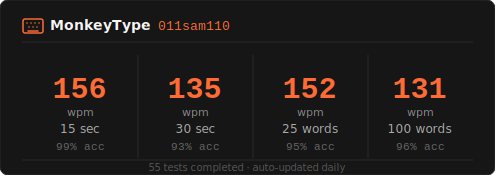

<div align="center">

```
  ░████     ░██     ░██                                                           ░██     ░██     ░████   
 ░██ ░██  ░████   ░████                                                         ░████   ░████    ░██ ░██  
░██ ░████   ░██     ░██            ░███████   ░██████   ░█████████████            ░██     ░██   ░██ ░████ 
░██░██░██   ░██     ░██   ░██████ ░██              ░██  ░██   ░██   ░██ ░██████   ░██     ░██   ░██░██░██ 
░████ ░██   ░██     ░██            ░███████   ░███████  ░██   ░██   ░██           ░██     ░██   ░████ ░██ 
 ░██ ░██    ░██     ░██                  ░██ ░██   ░██  ░██   ░██   ░██           ░██     ░██    ░██ ░██  
  ░████   ░██████ ░██████          ░███████   ░█████░██ ░██   ░██   ░██         ░██████ ░██████   ░████   
```

### Hi, I'm Sam 👋

[](https://git.io/typing-svg)

[](https://011-sam-110.github.io)
[](mailto:sam.poplett15@gmail.com)
[](https://github.com/011-sam-110)
[](https://monkeytype.com/profile/011sam110)

</div>

---

## 👤 About Me

```yaml
name:     Sam Poplett
role:     CS with AI Student · Hackathon Builder · AI Engineer
uni:      University of Sussex · Year 1
location: United Kingdom
focus:
  - Agentic AI systems & LLM pipelines
  - Computer vision & multi-modal models
  - Full-stack web development
  - Competitive programming
currently_learning:
  - Deep learning fundamentals
  - Advanced computer vision
  - System design & architecture
```

---

## 🛠 Tech Stack

**Languages**

[](https://skillicons.dev)

**AI / ML & Tools**

[](https://skillicons.dev)

**Web & Frameworks**

[](https://skillicons.dev)

---

## ⌨ Typing Speed

<div align="center">



</div>

---

## 🔥 Featured Projects

| Project | What it does | Stack |
|---------|-------------|-------|
| [**AI Banking Compliance Auditor**](https://github.com/011-sam-110/2026-Silent-Data-Hackathon-Entry) | AML/KYC compliance platform — Gemini 2.0 Flash + Markov credit model + SHA-256 blockchain verification. Built for the Silent Data Hackathon. | Python · Streamlit · Gemini |
| [**The Navigator**](https://github.com/011-sam-110/Sussex-Hackathon-2026-Solo-Entry-) | AI desktop assistant for older users. GPT-4o Vision reads the screen; custom command language drives precise clicks & keystrokes. Solo 24h build. | Python · FastAPI · GPT-4o |
| [**Motion-Detecting LLM Assistant**](https://github.com/011-sam-110/Motion-Detecting-LLM-Assistant) | Face-activated AI agent that talks back with emotional neural TTS and analyses its surroundings when idle. Multi-threaded vision → LLM → speech pipeline. | Python · OpenCV · GPT-4o-mini |

---

## 📊 GitHub Analytics

<div align="center">


</div>

<div align="center">

[](https://git.io/streak-stats)

</div>

---

## 🏆 Trophies

<div align="center">

[](https://github.com/ryo-ma/github-profile-trophy)

</div>

---

## 🏅 Highlights

- **Silent Data Hackathon 2026** — Built AI compliance auditor with Gemini 2.0 + blockchain verification
- **Sussex Hackathon 2026** — Solo 24h entry: full-stack AI desktop assistant for accessibility
- **3 AI projects shipped** in Year 1 of university
- Experienced with Claude as a development platform — agentic workflows, parallel sub-agents, MCP integrations, structured prompt engineering, and context management

---

<div align="center">

**→ Full portfolio at [011-sam-110.github.io](https://011-sam-110.github.io)**

*"Building things. Learning things. Shipping things."*

</div>
